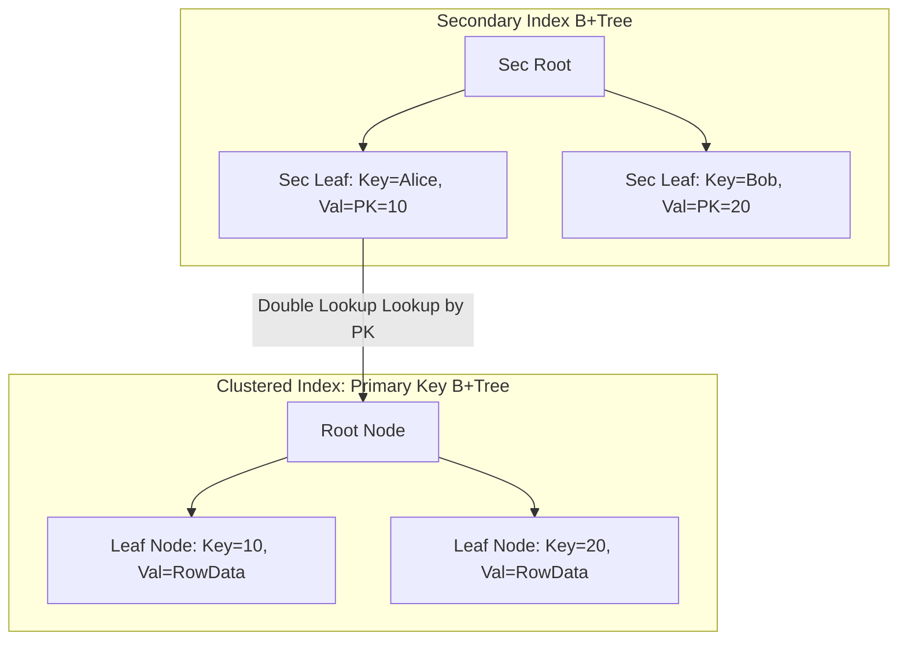

# Topic 3: MySQL/InnoDB Internal Architecture

This document explores the architecture and internals of the MySQL InnoDB storage engine, focusing on Clustered Indexes, the Buffer Pool eviction strategy, MVCC via Undo Logs, crash recovery via Redo Logs, and Gap Locking under REPEATABLE READ.

---

## 1. Clustered Index Architecture

The InnoDB storage engine organizes tables as **Index-Organized Tables (IOT)**.



### Why Secondary Indexes Store the Primary Key
In InnoDB, leaf nodes of the Primary Key B+Tree contain the actual row data (clustered index). Leaf nodes of secondary indexes store only the value of the primary key for that row, rather than direct row pointers.

* **Resilience to Internal Page Changes**: If a row grows and causes a page split in the clustered index B+Tree, or if a table is defragmented, the row's physical address on disk changes. Because secondary indexes point to the logical Primary Key rather than physical locations, **no secondary indexes need to be updated during page splits**.
* **Double Lookup Penalty**: Unless a query is fully satisfied by the columns present in the secondary index itself (a *covering index*), InnoDB must perform a double lookup: first search the secondary B+Tree to retrieve the primary key, and then traverse the clustered index B+Tree to fetch the full row data.

---

## 2. Buffer Pool & Midpoint LRU Insertion

InnoDB caches data pages, index pages, and system metadata in a region of memory called the **Buffer Pool**.

### Midpoint Insertion Strategy
To prevent sequential scan operations (e.g., executing `SELECT * FROM large_table`) from evicting highly active cached pages, InnoDB uses a modified **Midpoint LRU** algorithm:

```
        LRU LIST (Total Size)
|<------------------ 5/8 (62.5%) ------------------>|<------- 3/8 (37.5%) ------->|
+---------------------------------------------------+-----------------------------+
|               New (Young) Sublist                 |      Old Sublist            |
+---------------------------------------------------+-----------------------------+
^                                                   ^                             ^
Head (Most Recently Used)                      Midpoint (New Page Entry)       Tail (Evicted)
```

* The LRU list is split into two parts: a **New (Young) Sublist** (default: 5/8ths from head) and an **Old Sublist** (default: 3/8ths to tail).
* The boundary between these lists is the **Midpoint**.
* **New Page Insertion**: When a page is read from disk, it is inserted at the **Midpoint** (i.e., at the head of the Old Sublist), rather than the head of the entire list.
* **Protection Against Eviction**:
  - If a page is read once (e.g., during a full table scan) and never queried again, it slowly slides down the Old Sublist and is evicted from the tail. The hot pages in the Young Sublist remain untouched.
  - If a page in the Old Sublist is accessed again after a minimum time threshold (defined by `innodb_old_blocks_time`, default 1000ms), it is promoted to the head of the Young Sublist.

---

## 3. MVCC via Undo Log Chains

Unlike PostgreSQL, which writes multiple versions of a row directly to the main heap, **InnoDB implements MVCC via in-place updates and Undo Logs**.

```
CLUSTERED INDEX RECORD (In-place)
+--------------+---------------+-----------------+--------------+
| User Columns | DB_TRX_ID: 12 | DB_ROLL_PTR: --------+         |
+--------------+---------------+-----------------+    |         |
                                                      v
                                            UNDO LOG RECORD (Older Version)
                                            +--------------+---------------+
                                            | Old Columns  | DB_TRX_ID: 10 |
                                            +--------------+---------------+
```

1. **In-place Modifications**: When a row is updated, InnoDB writes the new values directly into the clustered index record.
2. **System Columns**:
   - `DB_TRX_ID`: A 6-byte field indicating the transaction ID of the last insert or update.
   - `DB_ROLL_PTR`: A 7-byte roll pointer pointing to the undo log record containing the prior version of the row.
3. **Reconstructing History**: If a transaction needs to read an older snapshot of the row, it accesses the current record in the clustered index, checks the `DB_TRX_ID`, and then follows the `DB_ROLL_PTR` chain back through the undo log records to dynamically reconstruct the row's state at the target snapshot time.
4. **Purging**: When older transaction snapshots commit and are no longer active, the background **Purge Thread** deallocates the corresponding undo log records.

---

## 4. Redo Log & Crash Recovery

### The Doublewrite Buffer (Torn Page Prevention)
Filesystems typically write data in blocks of 4KB, whereas InnoDB uses a default page size of 16KB. If the database crashes mid-write, a page might only be partially written to disk (known as a **Torn Page**). Since the page is corrupted, standard redo logs (which assume a valid page state) cannot fix it.

InnoDB solves this using the **Doublewrite Buffer**:
1. Before writing a dirty page to its data file, InnoDB writes the page to a contiguous layout on disk called the Doublewrite Buffer, and runs `fsync()`.
2. InnoDB then writes the page to its actual table workspace.
3. **Recovery**: If a crash occurs during step 2, InnoDB detects the page corruption, restores the original page from the Doublewrite Buffer, and then applies the redo log.

### Redo Log (WAL)
InnoDB writes physical-to-logical changes to a circular log structure (`ib_logfile0`, `ib_logfile1`). The write pointer loops through these logs. When dirty pages are written back to disk, the log tail is moved forward. If the write pointer catches up with the tail, InnoDB triggers a sync checkpoint, blocking incoming writes until the tail is cleared.

---

## 5. Gap Locks & Next-Key Locks

In standard SQL databases, executing queries under `REPEATABLE READ` is prone to **Phantoms**: where a range query yields new records inserted by a concurrent transaction between executions.

InnoDB prevents phantoms using **Next-Key Locks**.

* **Record Lock**: A lock on a specific index record.
* **Gap Lock**: A lock on the empty space (gap) between index records, or before the first and after the last index records.
* **Next-Key Lock**: A combination of a record lock on an index record and a gap lock on the gap preceding that index record.

### How Gap Locking Works
Consider an index containing values `10` and `20`. The index has three distinct gaps:
1. $(-\infty, 10)$
2. $(10, 20)$
3. $(20, \infty)$

If a transaction runs:
```sql
SELECT * FROM users WHERE age BETWEEN 11 AND 19 FOR UPDATE;
```
InnoDB places a next-key lock on the index record `20` (locking the interval $(10, 20]$). If a concurrent transaction tries to insert a row with `age = 15`, the insert blocks on the gap lock, preventing phantoms.
