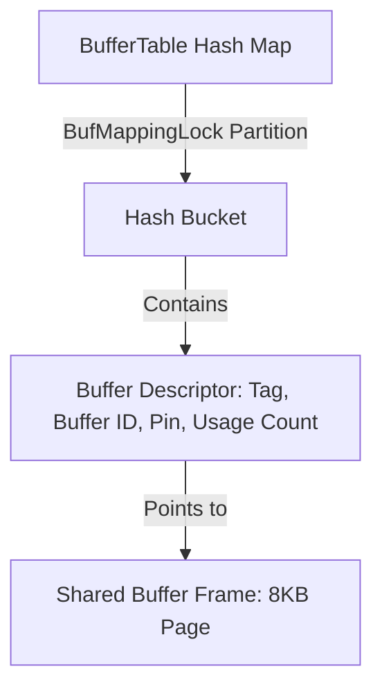

# Topic 2: PostgreSQL Internals Deep Dive

This document details the internal systems that power PostgreSQL, focusing on its Buffer Manager, `nbtree` (B-Tree) Index architecture, Multi-Version Concurrency Control (MVCC), and Write-Ahead Logging (WAL) subsystems.

---

## 1. The Shared Buffer Manager

PostgreSQL bypasses standard OS file caching for active query processing by managing its own **Shared Buffer Pool** in shared memory.



### Clock Sweep Eviction (Second-Chance)
When a page is requested, PostgreSQL checks the `BufferTable` to see if it is cached. If it is not, and no free buffer slots exist, it runs a **Clock Sweep** algorithm to select a page to evict:

1. **Clock Hand Iteration**: The clock hand sweeps sequentially over the array of buffer descriptors in shared memory.
2. **Pin Count Check**: If a buffer is pinned (`pin count > 0`), it means a backend is currently reading or writing to it. The sweep skips it.
3. **Usage Count Evaluation**:
   - If the usage count is greater than 0, the sweep decrements the count by 1 and moves to the next descriptor.
   - If the usage count is 0 and the buffer is unpinned, this buffer is selected for eviction.
4. **Eviction**: If the selected page is dirty, it is scheduled for a write. Once clean, the page is replaced by the requested block. Its usage count is initialized to 1. The maximum usage count is capped at 5 to prevent one-off sequential scans from locking pages in cache indefinitely.

### BufferTable Hash Map
The `BufferTable` is a shared-memory hash table mapping a physical page key (BufferTag: `Relation ID`, `Fork Number`, `Block Number`) to a `Buffer ID`. 
- **BufMappingLocks**: The hash table is divided into multiple partitions (typically 128) protected by lightweight locks (`BufMappingLocks`). This partitioning allows multiple backends to concurrently look up or insert keys into different buckets without blocking each other.

### Why PostgreSQL Avoids `mmap`
Many embedded databases use memory-mapped files (`mmap`) to let the OS manage virtual memory pages. PostgreSQL explicitly avoids this for three reasons:

1. **Strict WAL Ordering (Write-Ahead Logging)**: A dirty database page must *never* be written to disk before its corresponding WAL record has been flushed. With `mmap`, the operating system's kernel page daemon can flush dirty pages to disk at any time, which would violate WAL invariants and risk database corruption on crash.
2. **Robust Error Handling**: If an I/O error occurs while accessing a memory-mapped page (e.g., drive failure, sector corruption), the OS sends a `SIGBUS` signal to the process. Handling `SIGBUS` gracefully within a database daemon is complex. Using explicit system calls like `read()`, `write()`, and `fsync()` allows standard, structured error codes (`EIO`, `ENOSPC`) to be handled gracefully.
3. **Scale and TLB Overhead**: Large databases spanning terabytes require massive page tables. Maintaining these mappings in memory leads to significant Translation Lookaside Buffer (TLB) shootdown overhead during process execution on multi-core systems.

---

## 2. nbtree (B-Tree) Implementation

PostgreSQL's default index type is the `nbtree`, based on the Lehman & Yao B-Tree algorithm.

### Page Layout & Sibling Pointers
In addition to the standard page header, index pages contain a **Special Space** at the end of the page. This space holds:
- `btpo_next`: A pointer (block number) to the right sibling page.
- `btpo_prev`: A pointer to the left sibling page.
- `btpo_level`: The depth level of the page in the B-Tree (0 for leaf pages).

### The High Key Concept
Every non-rightmost B-Tree page contains a **High Key** stored as its first item. The high key represents the strict upper bound of keys allowed on that page. Any key inserted on this page must be $\le$ the High Key.

```
+-------------------------------------------------------+
|                 B-Tree Page Header                    |
+-------------------------------------------------------+
| [HIGH KEY: "Jackson"]  <-- Upper bound for this page  |
+-------------------------------------------------------+
|  "Adams"  |  "Baker"  |  "Clark"  |  "Davis"          |
+-------------------------------------------------------+
|                 btpo_next ---> Points to Sibling Page |
+-------------------------------------------------------+
```

### Lehman-Yao Page Split Protocol
In a standard B-Tree, splitting a page requires locking both the leaf page and its parent page to update pointers. Under high write concurrency, this lock hierarchy can lead to deadlocks and performance bottlenecks.

Lehman & Yao's key observation is that by adding right-sibling pointers and a High Key, **we can read and write to the B-Tree without holding locks on parent pages**.

1. **Split Process**: When a leaf page fills up and needs a split, a new right-sibling page is allocated. Half of the keys are moved to the new page.
2. **Right Link Update**: The original page's right link is updated to point to the new sibling page, and its High Key is set to the lowest key of the new sibling. This write operation is atomically committed.
3. **Traversal During Split**: If a concurrent reader traverses down to the original page before the parent has been updated to point to the new sibling, it compares the target search key against the page's High Key:
   - If the search key is greater than the High Key, the reader knows a split occurred and follows the right-sibling link (`btpo_next`) to find the key.
   - **No Parent Lock Required**: The search succeeds without needing to acquire locks up the tree. The parent index entry is updated asynchronously later by a background worker.

### Sequential Insert Fast Path
Monotonically increasing keys (like serial IDs or timestamps) normally require scanning down the tree to the rightmost leaf page for every write. PostgreSQL implements a **Fast Path** for sequential inserts:
- It maintains a cached pointer to the rightmost leaf page of the index.
- If the new key is greater than the last key on this cached page, it skips the traversal step entirely and inserts the key directly into the page, dramatically reducing CPU cache misses and lock contention.

---

## 3. Multi-Version Concurrency Control (MVCC)

### `xmin`/`xmax` Tuple Versioning
Every row (tuple) in a PostgreSQL table has metadata headers including:
- `t_xmin`: The Transaction ID (TxID) of the transaction that inserted the row.
- `t_xmax`: The TxID of the transaction that deleted or updated the row. For active rows, `t_xmax` is set to 0.

An `UPDATE` is physically represented as a `DELETE` followed by an `INSERT`:
1. The transaction marks the old tuple as deleted by setting its `t_xmax` to the current TxID.
2. The transaction inserts a new version of the tuple with its `t_xmin` set to the current TxID.

### Snapshot Visibility Rules
When a transaction starts under `READ COMMITTED` or `REPEATABLE READ`, it obtains a **Snapshot**. This snapshot contains:
- `xmin`: The lowest TxID that is still active (uncommitted).
- `xmax`: The highest TxID assigned so far plus one (all transactions at or above this are in the future and invisible).
- `xip_list`: An array of all active TxIDs at the time the snapshot was taken.

For a tuple to be visible to a query, its inserting transaction must have committed before the snapshot, and its deleting transaction (`t_xmax`) must either not have committed or have been active at the snapshot time:

```
                  COMMIT STATUS OF TUPLE TRANSACTION
                  
               xmin (Oldest Active)       xmax (Newest TxID)
 <----------------------+----------------------+---------------------->
     All committed              Active           In the future
   (Always Visible)      (Check xip_list to    (Always Invisible)
                         determine visibility)
```

### VACUUM and Transaction ID Wraparound
Because rows are versioned, updates and deletes leave behind outdated versions on disk (known as **Dead Tuples**).

- **VACUUM**: Scans tables to locate and prune dead tuples. It updates the Free Space Map (FSM) so new writes can reuse the space.
- **TxID Wraparound Problem**: Transaction IDs are represented by a 32-bit unsigned integer (yielding $\approx 4.29$ billion IDs). When this wraps around, older transaction IDs would suddenly appear to be in the "future" and their rows would become invisible.
- **Freeze Operation**: To prevent this, PostgreSQL uses a freezing mechanism. When a table's age approaches a threshold (configured by `vacuum_freeze_min_age`), a `VACUUM` run scans the table and writes a special bit in the tuple's header flag indicating that the tuple is **Frozen** (`t_infomask` set to `HEAP_XMIN_FROZEN`). A frozen tuple is always older than any active transaction, avoiding the wraparound failure.

---

## 4. Write-Ahead Logging (WAL) & Crash Recovery

### Sequential Write Durability
Modifying heap files directly requires writing to arbitrary disk blocks (random I/O), which is slow. Instead, PostgreSQL uses **Write-Ahead Logging**:
- Any change to data or indexes is first written sequentially to a WAL buffer in memory.
- The WAL buffer is flushed to disk (`fsync()`) before a transaction is acknowledged as committed.
- Writing to WAL is highly sequential, allowing the database to maximize disk write throughput.

### Crash Recovery from Checkpoint
1. **Checkpoints**: At regular intervals, the `checkpointer` daemon flushes all dirty buffers from the shared buffer pool to disk. It then writes a `CHECKPOINT` record to the WAL, listing active transaction states.
2. **Recovery Phase**: If the system crashes, the database reads the control file to locate the last valid `CHECKPOINT` record. It scans the WAL sequentially *forward* from the checkpoint location, replaying all transactions (known as the **Redo** phase). Transactions that were not committed at the time of the crash are subsequently ignored.

### Synchronization with the Buffer Manager
The buffer manager enforces the **Write-Ahead Rule**: a dirty data page cannot be written back to disk until the WAL record describing its last modification has been written to persistent storage.
- Each page header contains a `pd_lsn` field representing the **Log Sequence Number** of the last WAL record that modified the page.
- Before flushing a dirty buffer, the buffer manager checks if `pd_lsn` is less than or equal to the currently flushed LSN on disk. If it is not, it blocks the page write and triggers a flush of the WAL buffer first.
