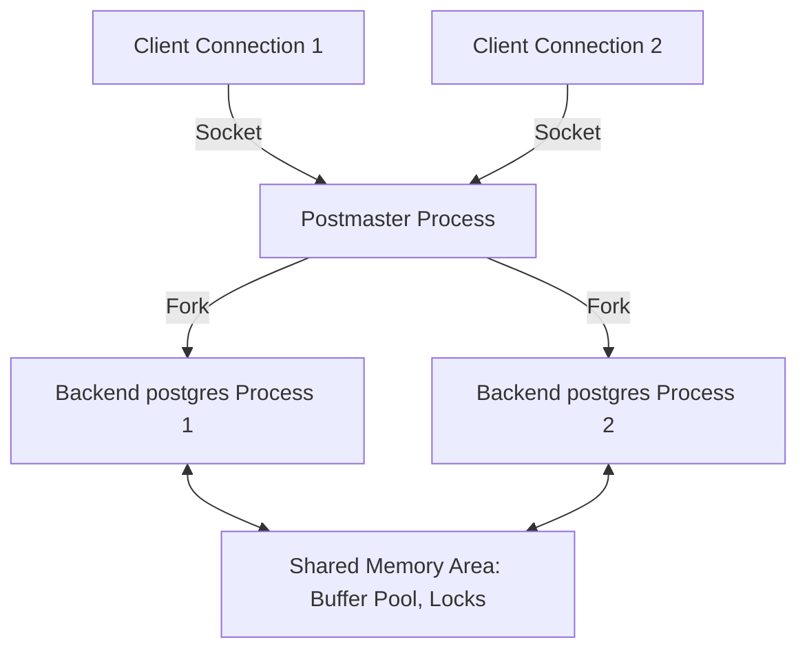

# Topic 1: PostgreSQL vs SQLite Architectural Comparison

This document provides a comparative analysis of the design architectures of PostgreSQL (a client-server RDBMS) and SQLite (an embedded database engine).

---

## Architectural Comparison Matrix

| Architectural Dimension | PostgreSQL | SQLite |
| :--- | :--- | :--- |
| **Process Model** | Multi-Process (Client-Server Daemon) | In-Process Library (Embedded) |
| **Storage Organization** | Directory of Heap Relations (split into 1GB segments) | Single cross-platform disk file |
| **Default Page Size** | 8 KB (fixed compile-time) | 4 KB (configurable 512 B to 64 KB) |
| **Concurrency Model** | MVCC (Readers & concurrent Writers do not block) | Single Writer serialization (WAL mode: 1 Writer + $N$ Readers) |
| **Secondary Index Target** | Heap Tuple ID (TID) (Block #, Offset #) | Primary Key / RowID |
| **Primary Use Cases** | Enterprise, High Concurrency, Web Apps, Complex Transactions | Embedded, Mobile, IoT, Local Testing, Low-Concurrency Caches |

---

## 1. Process Model Deep Dive

### PostgreSQL: Multi-Process Daemon
PostgreSQL operates as a process-oriented client-server database. When a client establishes a connection, the master process (known as `postmaster` or the controller process) forks a dedicated worker backend process (`postgres`) to handle that connection's lifecycle.



* **Address-Space Isolation**: Each client connection runs in its own OS process. If a client query encounters a fatal memory error, only that specific backend worker crashes, leaving other client connections and the main postmaster unaffected.
* **Shared Memory & IPC**: Processes coordinate updates using POSIX shared memory (for the shared buffer pool, locks, transaction status, etc.) and semaphores.
* **Process Overhead**: Spawning processes is computationally heavier than spawning threads. High connection rates degrade performance without connection pooling solutions (e.g., PgBouncer).

### SQLite: In-Process Library
SQLite has no server daemon, background processes, or sockets. The database engine code is compiled directly into the application and runs inside the application's process memory space.

* **Zero Latency**: Query execution involves direct function calls, eliminating network serialization, context switching, and socket overhead.
* **Shared Resources**: It shares the application's memory and CPU cycles. A crash in the host application can interrupt active writes, and a crash at a critical moment (without journal protection) could risk physical database integrity.

---

## 2. Storage Organization

### PostgreSQL: Directory of Heap Relations
PostgreSQL stores relations in a directory hierarchy named under `pg_data/base/`.
* **1 GB Segments**: Tables are split into physical files (segments) of exactly **1 GB** to maintain compatibility across filesystems with file-size limits.
* **Heap Structure**: Rows are written to pages in the order they are inserted (heap organization). There is no primary key sort order enforced in the main table layout.
* **Auxiliary Files**: Every relation consists of three main files:
  1. **Main Data File** (`<relfilenode>`): Holds the actual table tuples.
  2. **Free Space Map (FSM)** (`<relfilenode>_fsm`): Tracks available space inside active pages to locate where new tuples can be inserted.
  3. **Visibility Map (VM)** (`<relfilenode>_vm`): Tracks which pages contain only tuples committed prior to all active transactions. This optimizes index-only scans and VACUUM operations.

### SQLite: Monolithic Single File
SQLite stores the schema, tables, indexes, and metadata in a single cross-platform disk file.
* **Page-based Structure**: The file is structured as a sequence of equal-sized pages (numbered starting from 1).
* **B+Tree Storage**: By default, tables are stored as B+Trees using the table's integer `rowid` as the key, with actual column values stored in the leaf nodes. If a custom table defines `WITHOUT ROWID`, it is stored directly as an index B-Tree sorted by the user's primary key.

---

## 3. Page Layout Comparison

### PostgreSQL Slotted Page Layout
PostgreSQL uses a fixed 8KB page layout (though configurable at compile time):

```
+--------------------------------------------------------+
| PageHeaderData (24 bytes)                              |
|   - LSN (Log Sequence Number)                          |
|   - Flags (pruned, full, etc.)                         |
|   - pd_lower (byte offset to start of free space)      |
|   - pd_upper (byte offset to end of free space)        |
+--------------------------------------------------------+
| Line Pointers (ItemIdData)                             |
|   [Item 1 Pointer] [Item 2 Pointer] [Item 3 Pointer]   |
|   =======> (grows downwards)                           |
+--------------------------------------------------------+
|                      FREE SPACE                        |
+--------------------------------------------------------+
|   <======= (grows upwards)                             |
|   [Tuple 3 Data]    [Tuple 2 Data]    [Tuple 1 Data]   |
+--------------------------------------------------------+
| Special Space (Index-specific pointer data)            |
+--------------------------------------------------------+
```

* **Line Pointers (`ItemIdData`)**: Act as indirection offsets. They contain the offset to the tuple data and its length. This design allows PostgreSQL to move tuple data around inside the page during defragmentation (e.g., `VACUUM`) without changing the tuple's external identifier (TID).

### SQLite Cell Page Layout
SQLite uses a similar slotted-page concept but styles entries as **Cells**. 
* **Varints**: Cells contain both payload size, keys, and payload values packed tightly using Variable-Length Integers (Varints) (encoding 64-bit numbers in 1 to 9 bytes).
* **Freeblocks & Overflow**: Unused space is tracked using a chain of free blocks. If a page overflows (e.g., a tuple is larger than page capacity), SQLite creates **Overflow Pages**, linking them to the parent leaf cell.

---

## 4. Concurrency Model & Writes

### PostgreSQL: MVCC & Concurrent Writers
PostgreSQL leverages MVCC for read-write concurrency:
* **No Read-Write Blocking**: Readers do not block writers, and writers do not block readers.
* **Concurrent Writers**: Multiple transactions can write concurrently to different pages/tables. Row-level locks (`RowExclusiveLock`) are managed in a shared memory lock table, avoiding write serialization.

### SQLite: Serialization & WAL Concurrency
SQLite's concurrency is historically restrictive because locks are applied at the database file level:
* **Rollback Journal Mode**: A write transaction locks the entire database. No other transaction can read or write. Writes are serialized.
* **Write-Ahead Log (WAL) Mode**: Enables concurrent read operations alongside a single active write operation. 
  - Readers query pages by checking the WAL file (`.wal`) first and then the database file.
  - A single writer appends updates to the WAL file. 
  - Write concurrency remains **strictly serialized**: only one writer can execute transactions at a time. Attempts by concurrent threads to write result in an `SQLITE_BUSY` error.

---

## 5. Index Reference Mechanism

### PostgreSQL: Direct Heap TID
In PostgreSQL, secondary indexes (B-Tree, GIN, etc.) point directly to the physical storage location of the row via its **Tuple ID (TID)**, which is a pair of `(Block Number, Offset Index)`.
* **Fast Traversal**: Reading through a secondary index requires locating the TID, and then accessing the heap page at the specified block and offset.
* **Write Amplification (HOT Mitigation)**: If a row is updated and its columns change, a new physical tuple must be created on disk. This requires updating all secondary indexes to point to the new TID. To minimize this, PostgreSQL uses **Heap-Only Tuple (HOT)** updates: if the updated row fits on the same page and the indexed columns are unmodified, the old tuple points to the new tuple via a local chain, skipping index updates.

### SQLite: RowID Indirect References
In SQLite, secondary indexes store the index key mapped to the target table's `rowid` (or primary key).
* **Double Lookup**: To fetch a complete row through a secondary index, SQLite performs a B-Tree search on the index, retrieves the `rowid`, and then executes a second B-Tree search on the main table's clustered B+Tree.
* **Page-Split Resilience**: Because the index maps to a logical key (`rowid`) rather than a physical page offset, table page splits do not require rewriting any secondary indexes.

---

## 6. Real-world Use Case Decision Matrix

### When to choose PostgreSQL
1. **High Concurrent Writes**: Systems requiring hundreds of writes per second across different users.
2. **Complex Analytics and Relational Schema**: Large-scale reporting requiring hash joins, parallel query execution, and recursive CTEs.
3. **Enterprise Integration**: Scenarios requiring row-level security, fine-grained access control, logical replication, and triggers.

### When to choose SQLite
1. **Low-Latency Edge Deployments**: Desktop applications, mobile apps, or games where local file reads must be near-instantaneous.
2. **Zero-Configuration Microservices**: Embedded devices or isolated worker instances (e.g., serverless environments) that only write sequentially.
3. **Application File Format**: Replacing XML/JSON configs with a queryable database structure.
