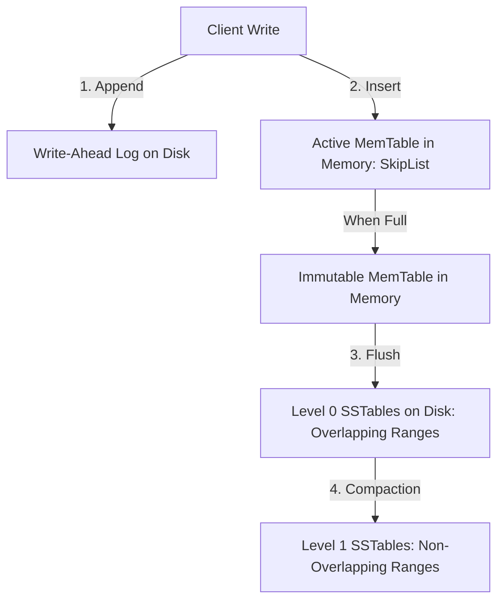

# Topic 4: RocksDB LSM-tree Storage Engine

This document explores the architecture and performance profile of the RocksDB embedded storage engine, covering LSM-tree components, Leveled Compaction, the RUM conjecture, sequential I/O benefits, and compaction details.

---

## 1. LSM-Tree Core Components

RocksDB is an embedded, key-value store optimized for fast storage media, implementing a **Log-Structured Merge-tree (LSM-tree)**.



1. **MemTable**: An in-memory write buffer where all new key-value updates, inserts, and deletes (represented as tombstone markers) are stored. It is typically implemented using a lock-free **SkipList**, ensuring concurrent read/write access and sorted iteration.
2. **Immutable MemTable**: When a MemTable reaches its capacity, it is marked as immutable and read-only. A new active MemTable is opened to receive writes.
3. **SSTable (Sorted String Table)**: A background worker flushes the Immutable MemTable to disk as an SSTable file.
   * SSTables are structured into blocks (typically 4KB in size): **Data Blocks** containing sorted keys and values, **Index Blocks** mapping keys to offsets, and **Filter Blocks** containing Bloom filters.
4. **Bloom Filters**:
   * A space-efficient, probabilistic data structure.
   * When searching for a key, RocksDB checks the Bloom filter first. If the filter returns false, the key is guaranteed *not* to be in the SSTable, and RocksDB skips reading the file from disk, optimizing read performance.

---

## 2. Leveled Compaction

LSM-trees organize SSTables into multiple tiers or levels ($L_0, L_1, L_2, \dots, L_N$), where each level's capacity is typically 10x larger than the previous (e.g., $L_1 = 10\text{MB}$, $L_2 = 100\text{MB}$, $L_3 = 1\text{GB}$).

* **Level 0 ($L_0$)**: Because files in $L_0$ are flushed directly from MemTables, their key ranges can overlap. A search key might exist in multiple $L_0$ files, requiring RocksDB to check all of them.
* **Levels $L_1$ to $L_N$**: Files within these levels are sorted and have non-overlapping key ranges. A lookup only requires searching a single SSTable per level.
* **The Compaction Process**: When a level exceeds its size limit:
  1. RocksDB selects one or more SSTables from that level.
  2. It merges them with overlapping SSTables from the next level using a multi-way merge-sort.
  3. It writes out new, sorted SSTables to the next level.
  4. Outdated versions of keys and deleted values (tombstones) are discarded during this process.

---

## 3. The RUM Conjecture (Read/Write/Space Amplification)

The **RUM Conjecture** asserts that you cannot optimize all three dimensions of data access simultaneously: **Read**, **Update (Write)**, and **Memory (Space)** amplification.

```
                  [Write Amplification] (LSM Target)
                         /\
                        /  \
                       /    \
                      /      \
                     /________\
 [Read Amplification]          [Space Amplification]
    (B-Tree Target)
```

1. **Write Amplification (WA)**:
   $$\text{WA} = \frac{\text{Bytes written to storage}}{\text{Bytes written by application}}$$
   * In LSM-trees, WA is high because keys are written to the WAL, flushed to disk, and rewritten multiple times as they migrate down levels during compaction.
2. **Read Amplification (RA)**:
   * The number of disk page reads required to satisfy a single read request. In LSM-trees, RA can be high because a read might search the active MemTable, Immutable MemTables, and several SSTable levels before finding the key.
3. **Space Amplification (SA)**:
   $$\text{SA} = \frac{\text{Physical space used on disk}}{\text{Logical size of data}}$$
   * In LSM-trees, SA is high because deleted keys and old versions persist as garbage on disk until a compaction cycle reclaims them.

### Compaction Strategy Comparison
* **Leveled Compaction**: Yields low Space Amplification and low Read Amplification (since keys are partitioned), but incurs high Write Amplification due to frequent merges.
* **Size-Tiered Compaction**: Groups SSTables into size cohorts. It merges them only when enough files of similar size accumulate. This reduces Write Amplification but increases Space and Read Amplification.

---

## 4. Sequential I/O & Write-Heavy Workloads

In traditional B-Tree databases, inserts or updates to arbitrary keys require modifying arbitrary pages on disk, resulting in random write I/O.
* On SSDs, random writes cause page fragmentation, triggering write amplification in the Flash Translation Layer (FTL).
* RocksDB avoids random writes entirely. All incoming writes are appended to the WAL and written sequentially to disk during MemTable flushes and compaction.
* Because sequential I/O is close to the physical storage media's hardware limit, RocksDB outperforms B-Trees in write-heavy scenarios.

---

## 5. Why Compaction is Necessary and Expensive

### Why it is Necessary
If RocksDB never performed compaction:
1. **Read Performance Collapse**: The number of SSTables would grow indefinitely. A read query would need to check hundreds of files, leading to high Read Amplification.
2. **Disk Exhaustion**: Deleted records (tombstones) and obsolete versions would never be reclaimed, leading to unbounded Space Amplification.

### Why it is Expensive
Compaction is a heavy process:
* **I/O Bottleneck**: It requires reading large files from disk, sorting them in memory, and writing them back. This competes with active client reads and writes.
* **CPU Overhead**: Compacting blocks requires continuous decompression, key comparison, and re-compression.
* **Write Stalls**: If the rate of incoming writes exceeds the background thread's compaction throughput, RocksDB temporarily throttles or freezes incoming writes (a write stall) to prevent the number of $L_0$ files from growing too large.
