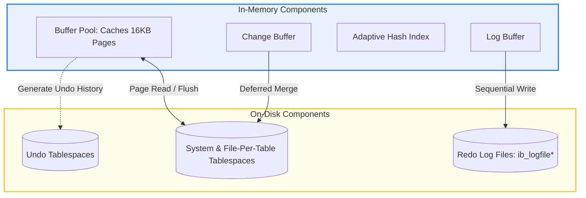

# **MySQL InnoDB Storage Engine: Architectural Analysis**

## **1. Design History & System Motivation**

### **Origins & Historical Context**
Early releases of the MySQL database database engine relied on **MyISAM** as the default storage manager. While MyISAM provided fast query performance for simple, read-mostly workloads, it lacked critical database features needed for enterprise applications:
1.  **No ACID Support:** No native capabilities for atomic `COMMIT` or transaction `ROLLBACK`.
2.  **Table-Level Lock Contention:** Any write operation required locking the entire table structure, blocking concurrent readers and writers, which restricted scaling.
3.  **Lack of Crash Recovery:** A sudden power loss or system failure during active writes could corrupt data files, requiring manual administration to recover.

To address these limitations, Heikki Tuuri designed the **InnoDB** storage engine (released in 2001 and subsequently acquired by Oracle). InnoDB was built as a fully transactional, crash-safe engine using row-level locking, clustered index storage, and write-ahead logging (via Undo and Redo logs) to support highly concurrent OLTP (Online Transaction Processing) workloads.

---

## **2. Architectural Overview**

### **Memory & Persistent Storage Subsystems**
InnoDB separates its operations into high-speed memory buffers and persistent disk tablespaces:
*   **Buffer Pool:** Caches active database pages (tables and indexes) in memory to reduce slow disk I/O.
*   **Log Buffer:** Caches transaction log entries in memory before flushing them to persistent redo logs.
*   **Change Buffer:** A specialized cache that buffers writes to secondary indexes when the target pages are not loaded in memory, merging changes later to avoid random disk I/O.
*   **Redo Log Files:** Persistent circular logs (`ib_logfile0`, `ib_logfile1`) on disk that guarantee write durability during system crashes.
*   **Undo Tablespaces:** Stores undo records tracking historical row versions used for transaction rollbacks and MVCC reads.

### **InnoDB Component Diagram**



---

## **3. Internal Subsystem Design**

### **Clustered Indexes & Primary Key Organization**
InnoDB structures tables as **Index-Organized Tables**.
*   **Clustered Index:** The primary key of the table is organized directly as a B+ Tree. Unlike heap-based storage where indexes point to a separate data file, the leaf nodes of InnoDB's clustered B+ Tree contain the **actual row data** for all columns.
*   **Point Query Performance:** Searching by primary key is efficient ($O(\log N)$) because traversing the B+ Tree retrieves the target data page directly, requiring only a single index lookup.
*   **PK Selection Rules:** If a table lacks a defined primary key, InnoDB uses the first non-nullable `UNIQUE` index. If no unique key is present, InnoDB automatically appends a hidden 6-byte transaction identifier (`ROW_ID`).

### **Secondary Indexes**
*   **Structure:** Non-primary keys (secondary indexes) are also organized as B+ Trees. However, their leaf nodes do not contain the full table row. Instead, they store the indexed column values alongside the **associated primary key value**.
*   **The Double-Lookup Process:** When querying via a secondary index (e.g., `SELECT * FROM users WHERE email = 'user@domain.com'`), InnoDB executes a two-step lookup:
    1.  Traverses the secondary B+ Tree index to locate the matching primary key.
    2.  Uses the retrieved primary key to traverse the clustered index B+ Tree to fetch the full row.


### **Buffer Pool Cache Management**
*   **Page Layout:** InnoDB coordinates physical memory transfers using fixed-size **16KB pages**.
*   **Midpoint LRU Algorithm:** To prevent bulk operations (such as table scans) from flushing hot data from memory, InnoDB splits its LRU eviction list:
    *   *New Sublist (5/8ths of the cache):* Holds frequently accessed hot pages.
    *   *Old Sublist (3/8ths of the cache):* Holds less active cold pages.
    *   Newly read pages are inserted at the "midpoint" (the boundary between the old and new sublists). A page is promoted to the new sublist only if it is accessed again after a configured delay (`innodb_old_blocks_time`), ensuring scan pages are evicted quickly.

### **Undo Logs & Redo Logs**
InnoDB uses two distinct transaction logging systems to enforce ACID properties:

*   **Redo Log (Enforces Durability via Write-Ahead Logging):**
    *   *Purpose:* Tracks physical mutations applied to data pages.
    *   *Operation:* When a transaction modifies a page, the change is written to the Log Buffer and then sequentially flushed to disk in the Redo Log files. On restart after a crash, InnoDB replays these logs to recover updates committed in memory but not yet written to tablespace files.
    *   *Flush Policies:* Controlled via the `innodb_flush_log_at_trx_commit` variable:
        *   `1` (Default): Redo records are written and synced to disk on every commit, ensuring ACID compliance.
        *   `0`: Redo logs are written and synced once per second. This is fast but risks losing up to one second of transactions during a crash.
        *   `2`: Redo logs are written to the OS cache at commit but synced to disk once per second. This survives database crashes but can lose data if the hosting operating system fails.

*   **Undo Log (Enforces Atomicity & MVCC via Logical Versioning):**
    *   *Purpose:* Records logical reverse operations. If a row is updated, the undo log stores the original data values.
    *   *MVCC Support:* When a transaction modifies a row, concurrent transactions read its original state by following the row's **Rollback Pointer (`ROLL_PTR`)** to reconstruct the historical row version from the Undo Logs.

### **Row Locking & Gap Locks**
InnoDB implements row-level locking using three distinct lock structures:
1.  **Record Locks:** Lock the target index entry.
2.  **Gap Locks:** Lock the empty space (the gap) *between* index records, or the space before/after index entries, preventing other transactions from inserting values into the range.
3.  **Next-Key Locks:** A combination of a Record Lock on the index entry and a Gap Lock on the gap preceding it.

> [!IMPORTANT]
> **Phantom Read Prevention:** Under the default `REPEATABLE READ` isolation level, InnoDB uses **Next-Key Locks** during index scans to block other transactions from inserting new rows within the query range, preventing phantom reads.

---

## **4. Architectural Trade-Offs (InnoDB vs. PostgreSQL)**

InnoDB's clustered storage and undo-based MVCC model represent a different set of trade-offs compared to PostgreSQL's heap-based, non-overwriting architecture:

| Component | MySQL (InnoDB) | PostgreSQL |
| :--- | :--- | :--- |
| **Physical Storage Layout** | Clustered Index B+ Tree (Index-Organized) | Unordered Heap Files |
| **Row Update Mechanism** | In-place update + Undo Log generation | Append-only (writes a new tuple version in the heap) |
| **MVCC Implementation** | Reconstructs historical versions from Undo Logs | Reads older tuple versions directly from the heap |
| **Index Updates** | Secondary indexes only change if the PK changes | All indexes must point to the new tuple version (unless HOT) |
| **Table Bloat & Cleanup** | Low bloat. A background Purge thread removes old undo. | High bloat. Requires periodic `VACUUM` processes. |

### **Trade-off Analysis:**
*   *Write Performance:* PostgreSQL has faster raw inserts because it appends to the first available heap page. InnoDB must search the B+ Tree structure to insert the row in sorted order.
*   *Space Management:* InnoDB is more space-efficient. It updates rows in-place, preventing table bloat. PostgreSQL creates duplicate row versions in the main table, requiring active vacuuming.
*   *Point Queries:* InnoDB is faster for primary key point queries because the row data is colocated with the key. PostgreSQL requires an index scan followed by a separate read of the heap page.

---

## **5. Benchmarks & Operational Analysis**

### **Locking Behavior & Phantom Read Prevention**
An experiment was conducted to observe how InnoDB's Gap Locking prevents phantom reads under the default `REPEATABLE READ` isolation level.

#### **Setup:**
*   **Table Schema:** `accounts` with columns `id INT PRIMARY KEY` and `balance INT`.
*   **Initial Data:**
    ```sql
    INSERT INTO accounts VALUES (10, 500), (20, 1000);
    ```

#### **Execution Sequence:**

| Step | Transaction A (`REPEATABLE READ`) | Transaction B | Operational Results & Behavior |
| :--- | :--- | :--- | :--- |
| **T1** | `BEGIN;` | | Transaction A starts. |
| **T2** | `SELECT * FROM accounts WHERE id BETWEEN 10 AND 20 FOR UPDATE;` | | Transaction A acquires **Next-Key locks** on the range `[10, 20]`. This locks record 10, record 20, and the gap `(10, 20)`. |
| **T3** | | `BEGIN;` | Transaction B starts. |
| **T4** | | `INSERT INTO accounts VALUES (15, 300);` | **BLOCKED:** Transaction B attempts to insert inside the locked gap `(10, 20)`. The insert request waits for Transaction A's locks to release. |
| **T5** | `SELECT * FROM accounts WHERE id BETWEEN 10 AND 20;` | | Transaction A reads the range again. It returns the exact same two rows (10 and 20). No phantom read occurred. |
| **T6** | `COMMIT;` | | Transaction A commits, releasing locks. |
| **T7** | | *(Transaction B completes insert)* | Transaction B unblocks and successfully inserts row 15. |

#### **Analysis of Observations:**
By placing a Gap Lock on the open range `(10, 20)`, InnoDB blocked Transaction B from inserting a new row with `id = 15`. This ensured Transaction A could run the query twice and get a consistent result set, preventing phantom reads.

---

## **6. Key Lessons & Operational Insights**

### **Takeaways**
*   **Primary Key Design:** Because secondary indexes map back to the primary key, large primary keys (such as UUID strings) will increase the size of secondary indexes, increasing memory consumption. Always prefer auto-incrementing integers or compact, sequential keys.
*   **Dual-Logging Strategy:** InnoDB separates logging responsibilities: Redo logs guarantee *durability* (protecting data from corruption during crashes), while Undo logs manage *consistency* (allowing transaction rollbacks and MVCC reads).
*   **Gap Locking Performance Trade-offs:** Next-key locks under `REPEATABLE READ` prevent phantom reads but reduce write concurrency. High-performance applications often lower the isolation level to `READ COMMITTED` (which disables gap locks) and handle phantom reads in the application layer.
*   **In-Place Updates Simplify Cleanup:** InnoDB's purge threads clean up old undo logs in the background without affecting the primary table structure, avoiding the table bloat and performance spikes associated with PostgreSQL's `VACUUM` process.