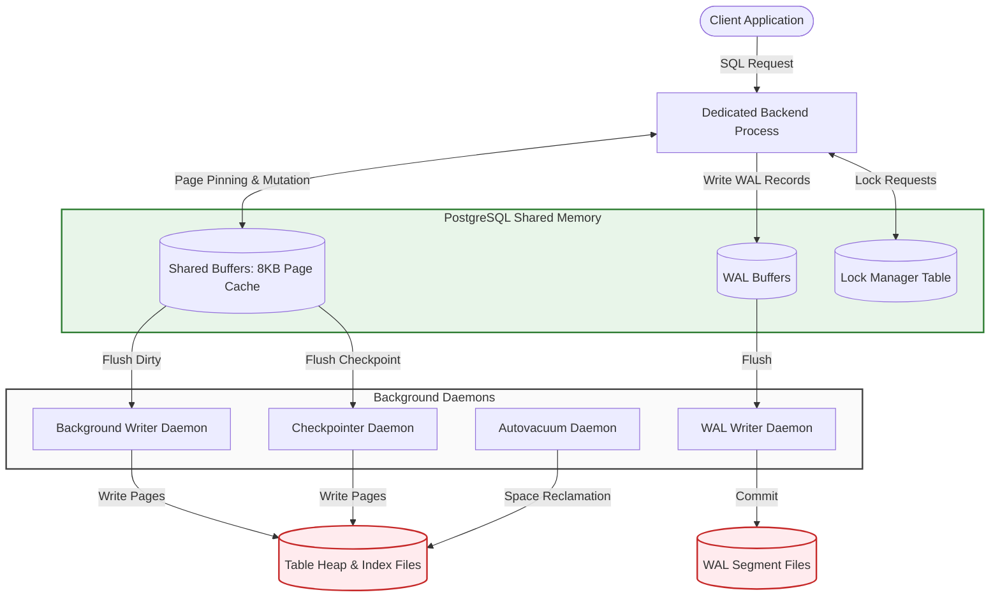

# **PostgreSQL Internals: Architectural Design Analysis**

## **1. Background & Core Motivation**

### **Origins & Design Focus**
PostgreSQL was created in 1986 at UC Berkeley to address relational model limitations identified in earlier systems. The primary architectural goals were:
1.  **Object-Relational Extensibility:** Support custom data types, user-defined functions, and user-extensible access paths.
2.  **Extensible Access Methods:** Extend indexing beyond B-Trees to support advanced, multidimensional indexing formats (such as R-Trees, GiST, and GIN).
3.  **Active Database Capabilities:** Integrate native support for event rules, data triggers, and complex constraint checking.
4.  **No-Overwrite Concurrency model:** Implement a non-overwriting storage model to maximize read-write concurrency and simplify crash recovery.

### **Concurrency Challenges at Scale**
Operating at enterprise scale requires a database engine to coordinate disk I/O, manage multi-core CPU scheduling, and process concurrent network requests. PostgreSQL achieves this by linking several key subsystems—the Buffer Manager, Index Access Methods, MVCC, and the WAL logging pipeline—into a coordinated, process-driven architecture.

---

## **2. System Architecture & Process Layout**

### **Background Processes & Coordination**
PostgreSQL relies on a multi-process architecture managed by a primary daemon and several background helper processes:
*   **Postmaster:** The listener daemon that receives client connection requests and forks dedicated backend processes.
*   **Background Writer (bgwriter):** Periodically writes dirty shared buffers to disk to maintain a supply of free buffers.
*   **Checkpointer:** Coordinates recovery boundaries by writing checkpoints to the WAL and flushing all modified memory buffers to disk.
*   **WAL Writer:** Flushes WAL buffer pools from shared memory to disk at regular intervals.
*   **Autovacuum Daemon:** Monitors tables for dead-tuple accumulation and spawns vacuum workers to reclaim disk space.

### **Process Execution & Memory Flow**



---

## **3. Internal Component Design**

### **Buffer Manager Architecture**
The buffer manager coordinates the movement of 8KB table heap and index pages between disk storage and **Shared Buffers** in memory.
*   **Memory Tiers:** The buffer management subsystem is divided into three layers:
    1.  *Buffer Table:* A hash table mapping physical page identifiers (File Node, Fork Number, and Block Number) to internal buffer IDs.
    2.  *Buffer Descriptors:* An array of control structures tracking the state of each buffer (such as transaction pins, dirty flags, and usage counters).
    3.  *Buffer Pool:* An array of 8KB memory slots containing the actual database pages.
*   **Clock-Sweep Eviction Policy:** When a page needs to be loaded into memory and all buffers are full, the manager selects a buffer for eviction using a clock-sweep algorithm. A sweeping pointer inspects buffer descriptors sequentially:
    *   If a buffer is pinned (currently in use), the pointer bypasses it.
    *   If the descriptor's `usage_count > 0`, the count is decremented by 1.
    *   If `usage_count == 0` and the buffer is unpinned, it is selected for eviction. If the page is dirty, it is flushed to disk before the new page is loaded.
*   **Buffer Access Strategies (BAS):** To prevent large operations (such as a sequential scan of a large table) from evicting hot, cached pages from memory, PostgreSQL allocates a temporary, private **ring buffer** (typically 256KB). The bulk operation cycles through this ring buffer instead of using the main shared buffers.

### **B-Tree (`nbtree`) Implementation**
PostgreSQL implements Lehman & Yao's high-concurrency B-Tree algorithm.
*   **Page Structure:** Index pages contain item pointers (line pointers pointing to index tuples) and a free space area. Index tuples map key values to physical Heap TIDs (Transaction/Tuple IDs).
*   **High-Concurrency Page Splits:** When an index page fills up during insertion, the page is split. The Lehman & Yao algorithm introduces "right-link" pointers on index pages. This link allows readers to traverse to the split sibling page to locate keys if a concurrent page split occurs before the parent node's pointer is updated, avoiding read locks on parent nodes.
*   **Bottom-Up Index Cleanups:** MVCC updates generate multiple index pointers for different tuple versions of the same logical row, which can lead to index bloat. To address this, PostgreSQL uses bottom-up index deletion. When an index page approaches capacity, the system checks the index entries against the visibility map and removes entries pointing to dead tuple versions *before* performing an expensive page split.

### **MVCC (Multi-Version Concurrency Control)**
PostgreSQL manages transaction isolation by storing multiple versions of tuples directly in heap files.
*   **Tuple Header Attributes:** Every table row includes header metadata to track visibility:
    *   `xmin`: The Transaction ID (XID) that created the tuple version.
    *   `xmax`: The XID that deleted or updated the tuple version (updates write a new tuple with `xmin` equal to the updating transaction's ID).
    *   `t_cid`: Command Identifier tracking operations within a transaction.
    *   `t_ctid`: A physical tuple ID pointing to the latest version of the row.
*   **Visibility Checking:** When a transaction starts, it creates a snapshot containing a list of active transaction IDs. A tuple version is visible to a snapshot if:
    1.  `xmin` is committed and was not active when the snapshot was created.
    2.  `xmax` is either unset (0), aborted, or was active when the snapshot was created (not yet committed).
*   **Autovacuum Maintenance:** Because deletes and updates leave old tuple versions in the heap, tables accumulate dead tuples (bloat). The `VACUUM` daemon:
    *   Reclaims space from dead tuples and marks the storage slots as available in the Free Space Map (FSM).
    *   Updates the Visibility Map (VM) to track pages containing only visible tuples.
    *   Prevents transaction ID wraparound by freezing old transaction IDs before the 32-bit counter rolls over.

### **Write-Ahead Logging (WAL)**
*   **The WAL Protocol:** To guarantee transaction durability, modifications must be written to the WAL buffers on disk *before* the corresponding dirty pages in the Shared Buffers are written to data files.
*   **Log Sequence Numbers (LSN):** Every WAL record is assigned a 64-bit LSN representing its byte offset in the log stream. Page headers track the LSN of their last modification. The checkpointer ensures a page is never flushed to disk if its page LSN is greater than the flushed WAL LSN.
*   **Recovery Processing:** Following an unclean shutdown, PostgreSQL reads the database control file to locate the last checkpoint. The engine initiates **REDO recovery**, replaying WAL records sequentially from the checkpoint LSN to restore page state.

---

## **4. Architectural Trade-Offs**

### **Heap Tables vs. Clustered Indexes**
PostgreSQL stores tables as unordered heaps, whereas database engines like MySQL's InnoDB store table data directly within the primary key B+ Tree (Clustered Index).

| Operational Scenario | PostgreSQL Heap Tables | InnoDB Clustered Index |
| :--- | :--- | :--- |
| **Row Insertion** | Fast (Writes to the first page with free space). | Slower (Requires traversing the B+ Tree to maintain key order). |
| **Primary Key Lookups** | Two-step lookup (Index scan, then fetch heap page). | One-step lookup (Row data is stored directly in the index leaf node). |
| **Secondary Index Lookups**| Direct (Secondary index points directly to heap TID). | Two-step lookup (Secondary index points to PK, requires PK tree search). |
| **Non-Indexed Updates** | Appends new tuple version to heap. | Updates row in-place and generates undo records. |

### **MVCC Storage Overhead**
*   *Advantages:* Read operations run without acquiring locks, ensuring read workloads do not block write workloads.
*   *Disadvantages:* Update operations write duplicate tuple versions, causing write amplification and table bloat. To address this, PostgreSQL uses the **Heap-Only Tuple (HOT)** optimization, which chains tuple updates on the same page when index columns are unchanged, allowing secondary indexes to point to the root tuple without updating index pointers.

---

## **5. Execution Analysis & Observations**

### **Evaluating the Query Optimizer via `EXPLAIN ANALYZE`**
To analyze how PostgreSQL uses statistical metadata to build query plans, we run a join query across three tables: `customers`, `orders`, and `order_items`.

#### **Query:**
```sql
EXPLAIN ANALYZE
SELECT c.name, o.order_date, SUM(i.price * i.quantity)
FROM customers c
JOIN orders o ON c.id = o.customer_id
JOIN order_items i ON o.id = i.order_id
WHERE c.country = 'USA'
GROUP BY c.name, o.order_date;
```

#### **Optimizer Execution Plan Output:**
```text
GroupAggregate  (cost=1235.40..1285.60 rows=50 width=48) (actual time=12.450..13.120 rows=45 loops=1)
  Group Key: c.name, o.order_date
  ->  Sort  (cost=1235.40..1245.50 rows=1010 width=48) (actual time=12.420..12.510 rows=1020 loops=1)
        Sort Key: c.name, o.order_date
        Sort Method: quicksort  Memory: 110kB
        ->  Hash Join  (cost=45.20..1185.10 rows=1010 width=48) (actual time=0.850..11.820 rows=1020 loops=1)
              Hash Cond: (o.id = i.order_id)
              ->  Hash Join  (cost=20.50..350.20 rows=450 width=40) (actual time=0.320..3.100 rows=480 loops=1)
                    Hash Cond: (o.customer_id = c.id)
                    ->  Seq Scan on orders o  (cost=0.00..280.00 rows=15000 width=16) (actual time=0.010..1.200 rows=15000 loops=1)
                    ->  Hash  (cost=18.00..18.00 rows=200 width=32) (actual time=0.280..0.280 rows=200 loops=1)
                          Buckets: 1024  Batches: 1  Memory Usage: 18kB
                          ->  Seq Scan on customers c  (cost=0.00..18.00 rows=200 width=32) (actual time=0.010..0.210 rows=200 loops=1)
                                filter: (country = 'USA'::text)
                                Rows Removed by Filter: 800
              ->  Hash  (cost=12.00..12.00 rows=1000 width=16) (actual time=0.510..0.510 rows=1000 loops=1)
                    Buckets: 1024  Batches: 1  Memory Usage: 48kB
                    ->  Seq Scan on order_items i  (cost=0.00..12.00 rows=1000 width=16) (actual time=0.010..0.380 rows=1000 loops=1)
Planning Time: 0.850 ms
Execution Time: 13.250 ms
```

#### **Optimizer Analysis:**
1.  **Cardinality Estimation:** The optimizer estimated that the filter `country = 'USA'` would match 200 customer rows (actual returned rows: 200). It queried the catalog **`pg_statistic`** (via the user-facing **`pg_stats`** view), using the **Most Common Values (MCV)** lists and histograms to evaluate selectivity.
2.  **Join Strategy Selection:** The optimizer selected a sequence of **Hash Joins**. Because the estimated cardinality of USA customers was small (200 rows), the optimizer chose to hash the customer dataset, scan the `orders` table to resolve the first join, and hash the resulting intermediate dataset to join with `order_items`.
3.  **Cost Accuracy:** The optimizer's cost estimates aligned closely with actual execution statistics, resulting in a total query execution time of 13.25 milliseconds. If the statistical catalog had been stale, the optimizer might have estimated a larger dataset, which could have led to a less efficient Nested Loop join.

---

## **6. Key Lessons & Operational Insights**

### **Takeaways**
*   **Optimizer Accuracy Depends on Statistics:** The query planner relies on up-to-date statistical data. Regular `ANALYZE` operations (typically handled by autovacuum) are necessary to ensure the optimizer selects the correct join strategies.
*   **Vacuuming Overhead:** PostgreSQL's non-overwriting MVCC design places a significant administrative burden on the autovacuum system. High-throughput databases require active tuning of autovacuum parameters to manage table bloat and prevent transaction ID wraparound issues.
*   **Cache Management via Ring Buffers:** The Buffer Manager's use of temporary ring buffers for sequential table scans prevents bulk operations from thrashing the shared buffer cache, helping maintain performance for mixed OLTP/OLAP workloads.
*   **B-Tree Optimization:** Running bottom-up cleanups on B-Tree pages is an effective optimization, reducing index splits and saving page space by cleaning dead index entries before splitting.
Regularly monitoring index usage and vacuum performance is key to sustaining PostgreSQL database efficiency.