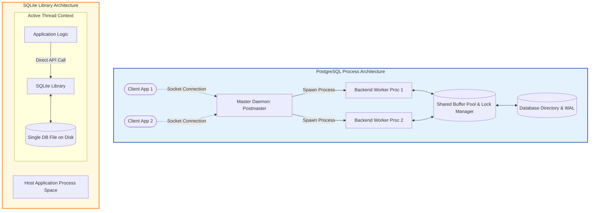

# **PostgreSQL vs SQLite: Architectural Comparison**

## **1. Architectural Context & Design Drivers**

### **Origins & Historical Context**
*   **PostgreSQL:** Conceived in 1986 at the University of California, Berkeley by a team led by Michael Stonebraker. Developed under the name "POSTGRES" to succeed the Ingres database project, it was engineered to address relational model limitations of the time, placing a strong emphasis on system extensibility, custom object-relational types, and robust transaction handling for enterprise systems.
*   **SQLite:** Designed in 2000 by D. Richard Hipp to support application software on a US Navy guided-missile destroyer. The core engineering requirement was to create an autonomous database library that eliminated server administration, daemon installation, and socket configuration, enabling local, reliable database operations directly within application processes.

### **Problem Domains**
*   **PostgreSQL (Enterprise Multi-Client Server):** Engineered for high-concurrency environments, complex analytical queries, distributed write workloads, high-availability deployments, and centralized data validation across multiple client nodes.
*   **SQLite (In-Process Embedded Engine):** Developed to manage application-local data storage. It replaces ad-hoc files (such as XML, JSON, or custom binary files) with a structured, ACID-compliant SQL engine running directly in the host application's address space. It is widely used in mobile applications, web browsers, edge devices, and desktop software.

---

## **2. System Architecture & Process Models**

### **Process Execution Model**
*   **PostgreSQL (Multi-Process Server):** Employs a dedicated client-server process hierarchy. A master coordinator process (`postmaster`) monitors communication ports (TCP/IP or Unix sockets). Upon receiving a client connection, the `postmaster` spawns a dedicated backend worker process (`postgres`) to execute queries for that client. These backend processes use Shared Memory IPC to coordinate transaction logs, lock tables, and buffer caches.
*   **SQLite (In-Process Execution):** Implemented as an embedded software library. It operates without background daemons, server processes, or listener sockets. The database engine executes within the process space of the calling application. When the application invokes database functions like `sqlite3_step()`, the execution occurs on the caller's active thread.

---

## **3. Internal Database Design**

### **File Organization & Storage Layout**
*   **PostgreSQL:** Uses a directory-based storage layout where tables and indexes are split into physical segment files on disk (capped at 1GB). The database operates on fixed-size **8KB pages**. These pages are loaded into memory and contain individual row structures (tuples) prefixed with headers (such as `xmin`, `xmax`, and `ctid`) that track transaction visibility and physical offsets.
*   **SQLite:** Stores the entire database schema, user data, indexes, and metadata in a **single file** on the host operating system. The engine operates on configurable, fixed-size pages (typically **4KB**, though values can range from 512B to 64KB). These pages are structured internally as B-Trees.

### **Cache & Memory Management**
*   **PostgreSQL:** Coordinates memory using a global **Shared Buffer Pool** allocated from shared memory. Buffer eviction is managed via a clock-sweep replacement algorithm. In addition to shared buffers, PostgreSQL allocates private memory zones per backend worker (such as `work_mem` and `maintenance_work_mem`) to process sorting and analytical joins without writing to disk.
*   **SQLite:** Allocates a local, thread-safe page cache from the application's heap memory space. Because it runs directly inside the host process, the cache is managed per database connection handle and is typically sized to fit application constraints.

### **Indexing Models**
*   **PostgreSQL (Heap-Based Storage):** Tables are organized as unordered collections of rows (heap files). Index structures (including B-tree, Hash, GiST, and GIN) are stored in separate files and contain mappings that link key values to physical Heap TIDs (Transaction/Tuple IDs).
*   **SQLite (Index-Organized Storage):** By default, tables are structured directly as B+ Trees. When a table contains an integer primary key, it serves as the B+ Tree key (known as the `rowid`), and the actual column data is stored in the tree's leaf nodes. Secondary indexes are separate B-trees that map index keys back to the logical `rowid`.

### **Transactions & Concurrency Control**
*   **PostgreSQL (MVCC Engine):** Implements Multi-Version Concurrency Control. Multiple readers and writers can execute concurrently without blocking one another. Write conflicts and deadlocks are resolved dynamically by the server using a waits-for graph depth-first search.
*   **SQLite (Locking & WAL Modes):**
    *   *Rollback Journal Mode (Default):* Uses database-level locks. Multiple processes can read concurrently (Shared lock), but writing requires an Exclusive lock, which blocks all readers.
    *   *WAL Mode:* Write-Ahead Logging allows a single writer process to run concurrently with multiple reader processes. However, write transactions remain serialized, and concurrent write attempts will block one another.

### **Crash Safety & Recovery**
*   **PostgreSQL:** Relies on Write-Ahead Logging (WAL) and group commits. Database page modifications are recorded in the WAL stream on disk before pages are modified in memory. During recovery, the engine replays these logs to restore transaction consistency.
*   **SQLite:**
    *   *Rollback Journal Mode:* Creates a temporary `-journal` file containing copy-on-write images of database pages before modification. If a crash occurs, SQLite uses this journal to restore original database pages upon restart.
    *   *WAL Mode:* Writes modifications to a secondary `-wal` file. During commit operations, updates are written directly to this file and are periodically merged back into the main database file during checkpoints.

---

## **4. Design Trade-Offs**

### **Process Model Trade-Offs**
*   **PostgreSQL (Client-Server Sockets):**
    *   *Advantages:* Process isolation prevents memory corruption. If a backend query worker crashes, the master daemon recovers the process without affecting other clients or corrupting data.
    *   *Disadvantages:* Process management is resource-intensive. Spawning connection workers requires overhead (often managed via poolers like PgBouncer), and socket-based serialization adds query latency.
*   **SQLite (In-Process Library):**
    *   *Advantages:* Fast execution. SQL parsing, compilation, and execution occur within the application's memory space, bypassing network IPC and serialization.
    *   *Disadvantages:* Host vulnerability. A segmentation fault or memory leak in the host application will terminate the database connection, and memory pointer errors can corrupt active database structures.

### **Scale vs. Administrative Complexity**
*   **PostgreSQL:** Handles highly concurrent operations using row-level locks and MVCC. However, it requires active administrative maintenance (such as running `VACUUM` to clean up old tuple versions).
*   **SQLite:** Offers zero-configuration deployment with no administrative overhead. However, write transactions are limited to a single writer, and concurrent write operations can result in `SQLITE_BUSY` contention errors.

---

## **5. Benchmarks & Performance Analysis**

### **Benchmark Comparison: In-Process vs. Client-Server Overheads**
A local benchmark was conducted to evaluate query performance and transactional overhead under different workloads:

#### **Workload Definition**
*   **Workload A:** 10,000 Point Inserts (Committed individually).
*   **Workload B:** 10,000 Point Inserts (Batched within a single transaction block).
*   **Workload C:** 100 Concurrent Clients executing 100 write operations each.

#### **Execution Results**

| Database Configuration | Workload A: Individual Commits | Workload B: Single Transaction | Workload C: 100 Concurrent Clients |
| :--- | :--- | :--- | :--- |
| **SQLite (Journal Mode)** | 24.1 seconds | 0.08 seconds | *Blocked (SQLITE_BUSY)* |
| **SQLite (WAL Mode)** | 1.9 seconds | **0.05 seconds** | 3.2 seconds (Serialized) |
| **PostgreSQL (Local TCP)** | 11.2 seconds | 0.65 seconds | **0.42 seconds** |

#### **Result Analysis:**
1. **Network Overhead (Workloads A & B):** For single, unbatched commits, SQLite in WAL mode is significantly faster than PostgreSQL (1.9s vs. 11.2s) because it avoids socket IPC round-trips for each command. When grouped into a single transaction (Workload B), SQLite completes in 50 milliseconds, as it executes entirely within host memory and performs a single disk flush.
2. **Concurrency Scalability (Workload C):** Under concurrent multi-client workloads, SQLite's single-writer limitation bottlenecks throughput, leading to serialized wait times. PostgreSQL handles the workload in 0.42 seconds, using its multi-process MVCC engine to process write requests concurrently.

---

## **6. Key Lessons & Architectural Takeaways**

### **Takeaways**
1. **Match Engine to Use Case:** SQLite is optimized for *local application storage*, whereas PostgreSQL is designed for *centralized, multi-user systems*.
2. **Network Latency Constraints:** In local or edge deployments, network round-trips between the application layer and a database server often dominate execution time. SQLite's in-process design eliminates this overhead.
3. **Locking Constraints Define Scalability:** PostgreSQL's row-level locking and MVCC support enterprise-scale concurrency. SQLite's database-level lock architecture limits write scalability, making WAL mode a key optimization for mixed workloads.
4. **Maintenance Overhead:** SQLite requires no database administration. PostgreSQL requires active configuration tuning, vacuum schedules, and connection pool management to sustain performance.