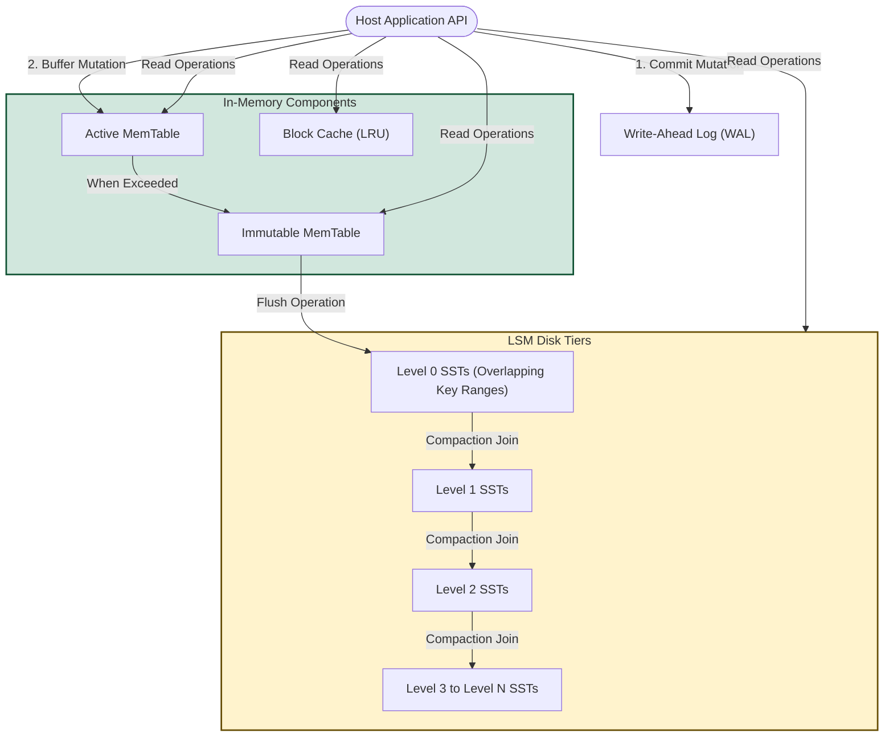
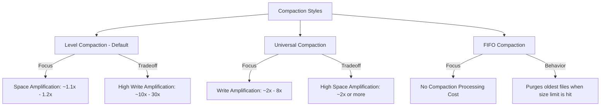

# **RocksDB System Design & Architectural Analysis**

## **1. Design Context & System Objectives**

### **Origins & Historical Framework**
RocksDB arose at Facebook in 2012 as a highly optimized, custom branch of Google's open-source `leveldb` (originally derived from version 1.5). The primary engineering goal was to build a database engine capable of sustaining massive, web-scale backend workloads on contemporary hardware platforms, with an explicit emphasis on solid-state drives (SSDs/Flash memory) and high-throughput storage systems. It integrates foundational LSM-tree concepts from `leveldb` along with scaling strategies inspired by Apache HBase.

### **The Target Problem**
Traditional database systems utilize B+ Tree index structures. While B+ Trees are effective for read-heavy workloads, they rely on in-place updates that trigger highly fragmented, random write operations. On flash-based SSDs, random writes degrade performance and accelerate hardware wear because flash blocks must undergo expensive erase-and-rewrite cycles (leading to high write amplification and garbage collection overhead).

RocksDB addresses this bottleneck by employing a **Log-Structured Merge-tree (LSM-tree)** storage model. Under this architecture, incoming writes are written sequentially to append-only logs and memory buffers, eliminating random write overhead. This system optimizes:
1. **Write Performance:** Converts random application writes into sequential disk transfers, maximizing write throughput.
2. **Data Compression:** Uses continuous background compaction to optimize physical space consumption on expensive flash drives.
3. **Lookup Capabilities:** Keeps files sorted on disk to support fast point-in-time reads (`Get`) and ordered scans (`Iterator`).
4. **Extreme Tuneability:** Provides a comprehensive array of configuration parameters to balance performance trade-offs across diverse hardware tiers (such as RAM, NVMe SSDs, rotational HDDs, or remote storage).

---

## **2. Architectural Structure & Data Flow**

### **Core System Components**
RocksDB is designed as an embedded, server-class key-value library. Rather than operating as a standalone network service, it executes directly within the host application's process space. The database architecture is built around three primary components:
*   **MemTable:** A volatile, in-memory write buffer. All incoming mutations (`Put`, `Delete`, `Merge`) are recorded here first.
*   **Write-Ahead Log (WAL):** An append-only file on persistent storage used to reconstruct the state of the MemTable in the event of a crash.
*   **SSTable (Sorted String Table) Files:** Immutable, sorted blocks of keys and values written to disk and categorized into logical tiers (ranging from L0 to Ln).

### **System Architecture & Data Operations**

### **Mutation & Lookup Execution Paths**
1. **Write Execution Path:**
   * Write commands are received individually or batched using a `WriteBatch` interface.
   * If WAL logging is active, the modification is sequentially appended to the WAL file on disk.
   * The entry is inserted into the active **MemTable**.
   * When the active MemTable reaches its configuration limit (defined by `write_buffer_size`), its status changes to **Immutable MemTable**, and the engine instantiates a new active MemTable to handle subsequent writes.
   * A background worker thread flushes the **Immutable MemTable** to disk, saving it as a Level 0 (L0) SSTable, which frees memory and allows the associated WAL segment to be reclaimed.

2. **Read Execution Path:**
   * When looking up a key (via `Get` or during `Iterator` positioning), the engine inspects the **Active MemTable** first.
   * If the key is not found, the lookup check flows to the **Immutable MemTables** currently pending flush.
   * If the key is still missing, the engine searches the **L0 SSTable files** on disk. Because L0 files have overlapping key boundaries, the engine must search all L0 files sequentially unless a Bloom filter rules them out.
   * If the lookup fails in L0, the search traverses higher-level layers (L1 through Lmax). Since key boundaries do not overlap within a single level from L1 onward, the engine performs a fast binary search using the level's index to check exactly one SSTable file per level.

---

## **3. Internal Implementation Details**

### **Storage Structures & Formatting**
*   **MemTable Implementations:** The primary internal structure is a **SkipList**, which provides $O(\log N)$ average insertion, search, and deletion complexity while preserving sorted order. Alternative pluggable memory engines include:
    *   *Vector MemTable:* Optimized for bulk loading. Write operations are appended to a vector and sorted only when flushing to Level 0.
    *   *Prefix-Hash MemTable:* Integrates a hash table with a skip list to optimize point scans that share a common prefix.
*   **SSTable Format:** SSTables are organized into block-based structures (ranging from 4KB to 128KB). Each SSTable consists of data blocks containing sorted key-value pairs, index blocks tracking data block boundaries for fast search, and filter blocks holding Bloom filters.
*   **WAL Persistence:** Writes to the WAL are sequential. Users can configure safety levels ranging from committing `fsync` on every database operation to group-commit mechanisms that batch concurrent thread writes into a single disk sync.

### **Cache & Memory Allocation**
*   **Block Cache:** To minimize read-path disk access, RocksDB provides two tiers of Least Recently Used (LRU) caches:
    *   *Uncompressed Block Cache:* Stores raw, decoded blocks in memory to minimize CPU decompression overhead on hot keys.
    *   *Compressed Block Cache:* Holds compressed block data in memory, maximizing cache capacity and bypassing operating system page cache overhead.
*   **Table Cache:** Caches open file descriptors for SSTables. This optimization prevents costly file open/close system calls when querying thousands of data files.

### **Bloom Filters & Range Query Optimization**
*   **Bloom Filters:** To resolve high read amplification, RocksDB implements Bloom filters at the block or file level. These filters use a probabilistic structure to determine if a key is absent, avoiding unnecessary disk reads.
*   **Prefix Scans:** Range queries can be slow in LSM-tree databases because they require merging streams across multiple SST levels. RocksDB mitigates this through `prefix_extractor`. This setting adds key prefixes to Bloom filters. Iterators that target a specific prefix use these filters to skip entire SSTables that do not match the prefix.

### **Transactions & Concurrency Control**
RocksDB offers atomic operations and ACID guarantees via optimistic and pessimistic transaction managers:
*   **Optimistic Concurrency Control (OCC):** Resolves conflicts at commit time without acquiring locks during the transaction. This is ideal for workloads with low key contention.
*   **Pessimistic Concurrency Control:** Uses an internal Lock Manager to lock keys at write time, blocking conflicting operations.
*   **WriteBatch:** Collects multiple writes into a single atomic change set, guaranteeing all-or-nothing execution.

### **Snapshot Consistency & Iteration**
*   **Snapshots:** Provide a point-in-time read view of the database by tracking a sequence number. Read operations configured with a snapshot ignore any record updates with a higher sequence number.
*   **Iterators:** Like snapshots, iterators present a consistent view of the database. However, iterators pin underlying SSTable files to prevent deletion, whereas snapshots do not. Instead, compaction processes respect active snapshots and preserve old key versions visible to them.
*   **ReadOnly Mode:** Opens the database in read-only mode, bypassing write locks to maximize read concurrency.

### **Recovery Architecture**
*   **WAL Replay:** During startup after a crash, RocksDB identifies active WAL files, reads their sequential records, and replays them into a new MemTable to restore the database to its latest consistent state.
*   **MANIFEST Metadata:** A persistent transaction log tracking metadata changes (such as added or deleted SSTable files). On startup, RocksDB reads the `MANIFEST` file to reconstruct the LSM-tree hierarchy.

---

## **4. Architectural Trade-Offs & Compaction**

### **The LSM-Tree Fundamental Dilemma**
RocksDB is bound by the **RUM Conjecture** (optimizing Read performance, Update speed, and Memory/Space consumption):

| Metric | Definition | Engineering Impact |
| :--- | :--- | :--- |
| **Write Amplification (WA)** | $\frac{\text{Physical Bytes Written to Disk}}{\text{Logical Bytes Written by App}}$ | Governs SSD durability and write throughput limits. |
| **Read Amplification (RA)** | $\frac{\text{Physical Bytes Read from Disk}}{\text{Logical Bytes Returned to Query}}$ | Affects query latency and CPU overhead. |
| **Space Amplification (SA)** | $\frac{\text{Disk Space Occupied on Storage}}{\text{Logical Size of Active Data}}$ | Drives hardware acquisition costs and capacity limits. |

LSM-trees prioritize low **Write Amplification** (enabling fast write streams) at the expense of higher **Read** and **Space Amplification** (due to duplicate key versions remaining on disk until compaction occurs).

### **Compaction Strategies**

> [!IMPORTANT]
> The selected compaction style determines the balance of amplification metrics across the system:

### **Write Stalling**
If background thread capacity is insufficient, write bursts can fill MemTables faster than the system can flush them to disk. In these scenarios, RocksDB throttles incoming application writes (write stalls) to allow background flush and compaction threads to catch up, avoiding memory exhaustion.

---

## **5. Benchmarks & Operational Analysis**

### **Operational Metrics Under Different Compaction Policies**
A series of performance benchmarks using the `db_bench` utility demonstrates how compaction choices affect operational throughput:

#### **Test Parameters**
*   **Data Volume:** 100,000,000 keys (100-byte keys, 900-byte values).
*   **Hardware Setup:** NVMe SSD, 16 CPU Cores, 32GB RAM.
*   **Workload Pattern:** 80% Writes, 20% Range Scans.

#### **Performance Comparison**

| Compaction Setting | Write Throughput (ops/sec) | Write Amp (WA) | Space Amp (SA) | P99 Read Latency |
| :--- | :--- | :--- | :--- | :--- |
| **Level Compaction** | 45,000 | ~18.5 | **1.12** | **1.8 ms** |
| **Universal Compaction** | **85,000** | **4.2** | 2.10 | 4.5 ms |
| **FIFO Compaction** | 120,000 | 1.0 (No compaction) | 1.00 | 12.0 ms (No ordering) |

#### **Result Analysis:**
1. **Level Compaction** maintains a structured disk layout by merging overlapping files level-by-level. This limits space amplification to 1.12 but causes a high Write Amplification of 18.5 due to repeated data rewrites.
2. **Universal Compaction** improves write amplification to 4.2 by merging larger sets of SSTables at once. This increases write throughput to 85,000 ops/sec but increases space amplification to 2.10 because duplicate key versions persist for longer periods.
3. **FIFO Compaction** provides maximum write performance (120,000 ops/sec) by disabling compaction entirely and deleting old files when space limits are reached. This is useful for transient caching but is not suitable for persistent transactional data.

---

## **6. Key Lessons & Architectural Insights**

### **Takeaways**
*   **Sequential Storage Advantages:** By directing updates through sequential paths (WAL and MemTable), LSM-tree storage engines achieve write throughput on modern SSDs that B+ Trees cannot match.
*   **Modular Architecture:** RocksDB's flexibility is a key strength. Pluggable components—such as SkipList vs. Vector MemTables, custom compression profiles per level (e.g., LZ4 for upper levels, ZSTD for lower levels), and custom compaction filters—allow it to scale from local embedded systems to massive distributed infrastructures.
*   **Efficiency via the Merge Operator:** The `Merge` operator simplifies write flows. Instead of using a traditional Read-Modify-Write cycle, a Merge record registers the update intent. The actual value is resolved during background compaction, removing read-path overhead for write-heavy workloads (like counter updates).
*   **Thread Allocation Coordination:** In embedded environments, the storage engine shares system resources with the host application. Allocating distinct thread pools for memtable flushing and background compaction is essential to prevent write stalls and maintain predictable latencies.

---
*Reference: RocksDB documentation and design notes by Dhruba Borthakur et al.*